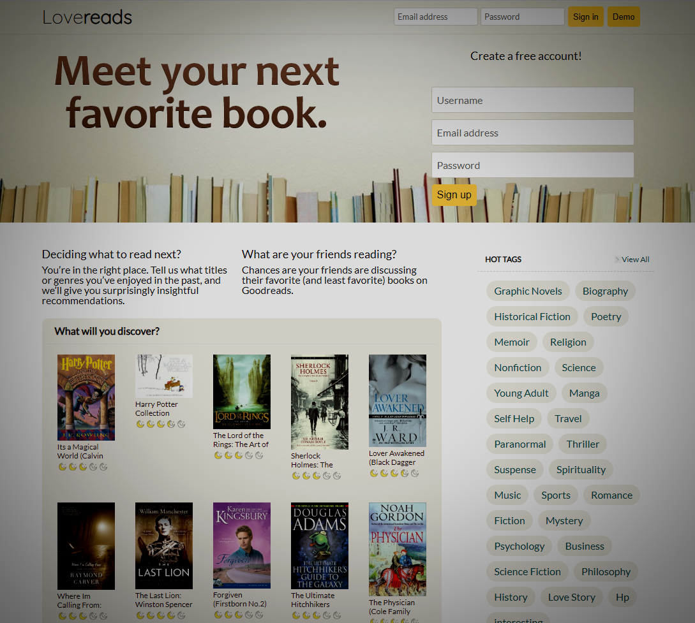

# LoveReads
GoodReads clone website

## Table of contents
* [General info](#general-info)
* [Screenshots](#screenshots)
* [Technologies](#technologies)
* [Features](#features)
* [Status](#status)
* [Contact](#contact)

## General info
Loveread is a Goodread clone based reading website. You can look into the information of the book, rate, review, comment, bookshelf and tag it.
It allows to search a particular book, provide booklists for newly published, top rated books. It also do personal recommendations based on user information.

link: https://lovereads.herokuapp.com/#/

## Screenshots

## Technologies
* Rails - version 5.2.4.1
* React 
* Redux 
* AWS

## Code Examples
Show examples of usage:
`put-your-code-here`

## Features
List of features ready and TODOs for future development
* Bookshelf: User can choose the status of the reading process of the book in the book's show page. People can change and delete the status. There's also a bookshelf section where user can browse all and by status of the books they've marked where user can delete the status.
* Tags: User can put multiple tags on a single book. The book's show page display all the tags that the current user has tagged on it. It also display the most often used tag on the book, which the number of user that has put this tag one the book, and the tags the user has used, with the number of times it has been used by the user. The user can choose from these tags to tag on the book. User can also create new tags to attach on the book. There's also a user's tag section where user can brose all and by tag name of the books they've taged. User can detach a tag from the book in this page.
* Rate & Review: User can create or update their rating on the book by clicking on the star rating system. User can also write or update their reviews on a seperate page. Commenting on the reviews is also realized.
* Search: Provide a search bar which enable user to search books through book title. A live-onchange drop down search list will show the first 5 results. Also when clicking on the lookup button, it will direct to a seperate page which shows the whole search results.
* multi book-lists: Users can fetch lists by features like newest books, top-rated books. this website also provide recommendations  for each user based on a naive recommendation algorithm.

## Status
Project is: _finished_

## Contact
Created by [@uranussg](https://uranussg.github.io/portfolio/) - feel free to contact me!
